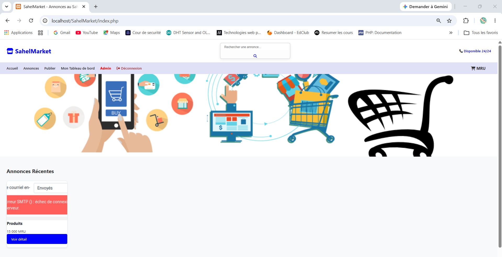
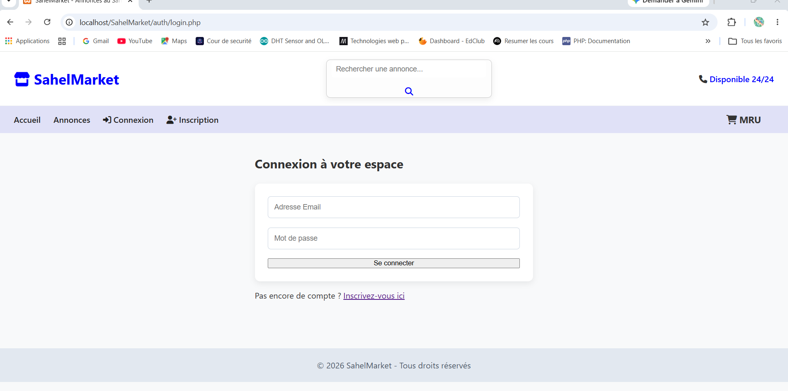

# 🌍 SahelMarket

**SahelMarket** est une application web dynamique de petites annonces et de commerce de proximité (C2C - *Consumer to Consumer*), spécialement configurée pour le marché local avec une gestion de la devise en **MRU**.

Ce projet a été développé de manière native en **PHP** et **MySQL** dans le cadre de mon parcours académique en Génie Logiciel. Il implémente une architecture modulaire, un contrôle strict des accès par rôles et les règles fondamentales de la sécurité web.

---

## 📸 Aperçu de l'application

### Page d'accueil


### Panel de connexion



## 🚀 Fonctionnalités Clés

### 👤 Espace Utilisateur & Client
* **Authentification Sécurisée :** Inscription et connexion avec hachage des mots de passe en base de données.
* **Tableau de Bord Personnel :** Interface centralisée permettant à chaque membre de suivre ses publications en cours.
* **Gestion des Annonces (CRUD) :** Création, modification et suppression d'annonces avec téléversement sécurisé d'images sur le serveur.
* **Moteur de Recherche :** Recherche textuelle dynamique par mots-clés combinée à un filtrage par catégories.

### ✉️ Messagerie Interne
* **Mise en relation directe :** Système permettant aux acheteurs d'envoyer un message privé au vendeur depuis la page de détails d'une annonce.
* **Boîte de réception :** Espace dédié pour lire les messages reçus et récupérer les coordonnées téléphoniques de l'acheteur pour finaliser la transaction.

### 🛡️ Panel d'Administration (Back-Office)
* **Contrôle d'accès :** Espace strictement réservé aux utilisateurs ayant le rôle `admin`.
* **Statistiques en temps réel :** Visualisation globale du nombre d'utilisateurs inscrits, d'annonces en ligne et de catégories.
* **Modération :** Outils de gestion pour ajouter ou supprimer des catégories globales et superviser les membres.

---

## 🔒 Sécurité Implémentée

La sécurité a été placée au centre du développement de cette plateforme :
* **Anti-Injection SQL :** Utilisation systématique de l'API **PDO** et de requêtes préparées (`$pdo->prepare()`) pour toutes les interactions avec la base de données.
* **Anti-Faille XSS :** Neutralisation systématique des données soumises par les utilisateurs via des fonctions d'échappement (`htmlspecialchars()`) avant tout affichage HTML.
* **Contrôle des téléversements :** Validation stricte des extensions d'images autorisées (`jpg`, `jpeg`, `png`, `webp`) et génération de noms de fichiers uniques (`uniqid()`) pour éviter les écrasements et l'exécution de scripts malveillants.

---

## 🛠️ Technologies Utilisées

* **Backend :** PHP 8 (Architecture modulaire et procédurale, gestion native des sessions et cookies)
* **Base de données :** MySQL (Relations, clés étrangères, jointures avancées `JOIN` et fonctions d'agrégation `COUNT`)
* **Frontend :** HTML5, CSS3 (Grille fluide et *Responsive Design* adaptatif), FontAwesome (Icônes vectorielles)
* **Environnement de test :** XAMPP, Serveur Apache, phpMyAdmin

---

## 📦 Installation Locale

Pour cloner et lancer ce projet sur votre machine locale (via XAMPP/WAMP) :

1. **Cloner le dépôt :**
   ```bash
   git clone https://github.com/banocamara/SahelMarket.GitHub.io.git
