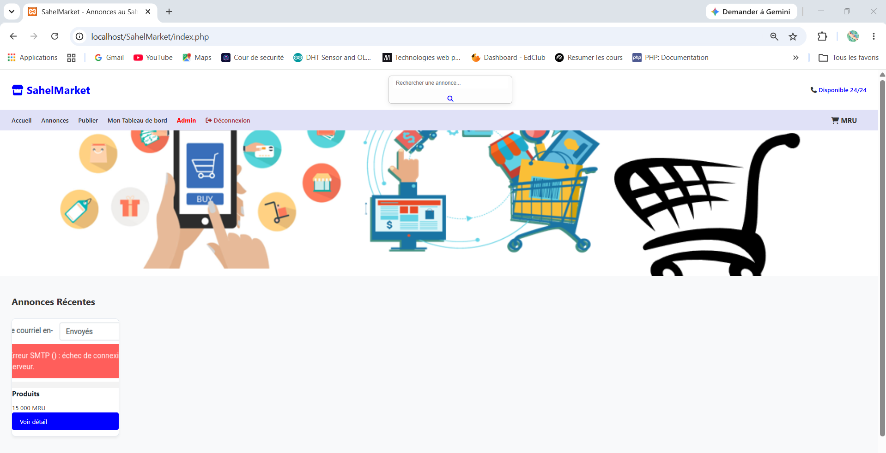
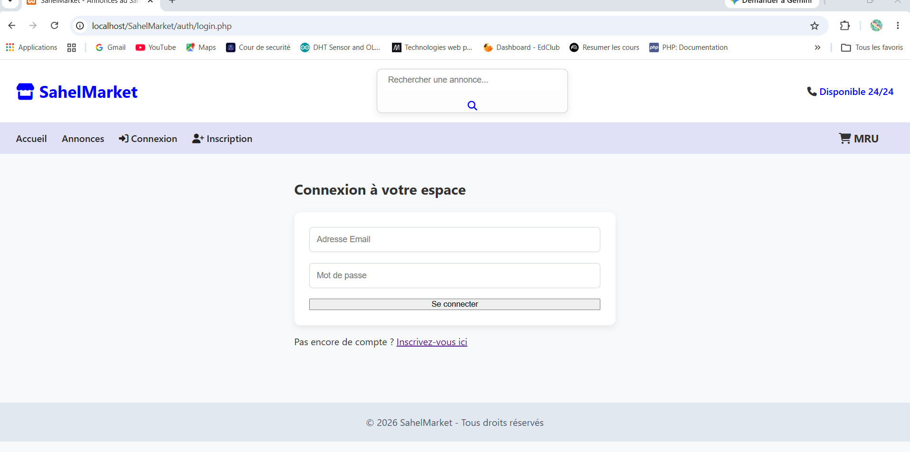

# 🛒 SahelMarket - Plateforme E-Commerce Local & Sécurisé

**SahelMarket** est une application web dynamique de petites annonces et de commerce de proximité (C2C - *Consumer to Consumer*), spécialement configurée pour le marché local avec une gestion native de la devise en **Ouguiya (MRU)**.

Ce projet a été conçu selon les meilleures pratiques du développement web moderne, combinant une architecture procédurale modulaire en **PHP 8**, une base de données relationnelle **MySQL** optimisée avec des fonctionnalités SQL avancées (Vues, Procédures stockées, Triggers), une protection applicative aux normes **OWASP Top 10** et un déploiement containerisé via **Docker & Docker Compose**.

---

## 📸 Aperçu de l'Application

### Page d'accueil & Catalogue


### Panel de Connexion Sécurisé


---

## 🚀 Fonctionnalités Clés

### 👤 Espace Utilisateur & Client
* **Authentification Sécurisée :** Inscription et connexion avec hachage robuste des mots de passe en base de données (`password_hash` avec `PASSWORD_DEFAULT`).
* **Politique de Complexité :** Exigence de mots de passe forts à l'inscription (au moins 8 caractères, 1 majuscule, 1 minuscule, 1 chiffre).
* **Tableau de Bord Personnel :** Interface centralisée permettant à chaque membre de suivre, modifier et supprimer ses annonces publiées (CRUD complet).
* **Gestion des Annonces :** Création, modification et suppression d'annonces avec téléversement sécurisé d'images sur le serveur.
* **Moteur de Recherche & Filtrage :** Recherche textuelle dynamique par mots-clés combinée à un filtrage instantané par catégories.

### ✉️ Messagerie Interne
* **Mise en Relation Directe :** Système permettant aux acheteurs d'envoyer un message privé au vendeur depuis la page de détails d'une annonce.
* **Boîte de Réception :** Espace dédié pour lire les messages reçus et récupérer les coordonnées téléphoniques de l'acheteur pour finaliser la transaction.

### 🛡️ Panel d'Administration (Back-Office)
* **Contrôle d'Accès par Rôle (RBAC) :** Espace strictement réservé aux utilisateurs ayant le rôle `admin`.
* **Statistiques en Temps Réel :** Visualisation globale du nombre d'utilisateurs inscrits, d'annonces en ligne et de catégories.
* **Modération :** Outils de gestion pour ajouter ou supprimer des catégories globales et superviser les membres.

---

## 🔒 Sécurité Applicative Implémentée (OWASP Top 10)

La sécurité a été placée au cœur de l'architecture logicielle :
* **Protection Anti-CSRF :** Génération et vérification automatique de jetons cryptographiques aléatoires uniques (`csrf_token`) par session sur tous les formulaires d'authentification et d'action.
* **Protection Anti-Injection SQL :** Utilisation systématique de l'API **PDO** et de requêtes préparées (`$pdo->prepare()`) pour toutes les interactions avec la base de données.
* **Protection Anti-XSS :** Neutralisation systématique de toutes les données soumises par les utilisateurs via `htmlspecialchars()` avant tout affichage HTML.
* **Sécurisation des Téléversements :** Validation stricte des extensions d'images autorisées (`jpg`, `jpeg`, `png`, `webp`) et génération de noms de fichiers uniques (`uniqid()`) pour éviter l'exécution de webshells.
* **Journalisation d'Audit de Sécurité :** Traçabilité horodatée avec adresse IP de toutes les tentatives de connexion (réussites, échecs, attaques CSRF suspectées) enregistrées dans `logs/connexions.log`.

---

## 🗄️ Fonctionnalités SQL Avancées (`advanced_database_features.sql`)

La couche de données MySQL a été optimisée avec des objets SQL natifs pour garantir la performance et la cohérence des données :

1. **Vue SQL (`vue_annonces_completes`) :**
   * Centralise et simplifie la récupération des annonces actives en joignant automatiquement les informations du vendeur et le nom de la catégorie.
   * Réduit la complexité du code PHP en remplaçant les requêtes à multiples `INNER JOIN`.

2. **Procédure Stockée (`sp_ajouter_annonce`) :**
   * Encapsule l'insertion sécurisée et atomique des nouvelles annonces directement au niveau du moteur MySQL.

3. **Déclencheur Automatique (`trg_apres_ajout_annonce`) :**
   * Écoute l'événement d'insertion d'une nouvelle annonce et met automatiquement à jour le rôle de l'utilisateur de `'user'` vers `'vendeur'`.

---

## 🐳 Déploiement DevOps & Containerisation (Docker)

Le projet est entièrement prêt pour la production grâce à un environnement multi-conteneurs orchestré par **Docker Compose**.

### Architecture des Services (`docker-compose.yml`)
* **Service Web (`sahelmarket_web`) :** Serveur Web Apache avec **PHP 8.2** et extension `pdo_mysql`.
* **Service Database (`sahelmarket_db`) :** Serveur de base de données **MySQL 8.0** avec volume persistant (`db_data`) et initialisation automatique en 2 étapes (`01_database.sql` et `02_advanced.sql`).

### ⚡ Lancement en 1 Commande (Docker)

1. **Cloner le dépôt Git :**
   ```bash
   git clone [https://github.com/banocamara/SahelMarket.GitHub.io.git](https://github.com/banocamara/SahelMarket.GitHub.io.git)
   cd SahelMarket.GitHub.io